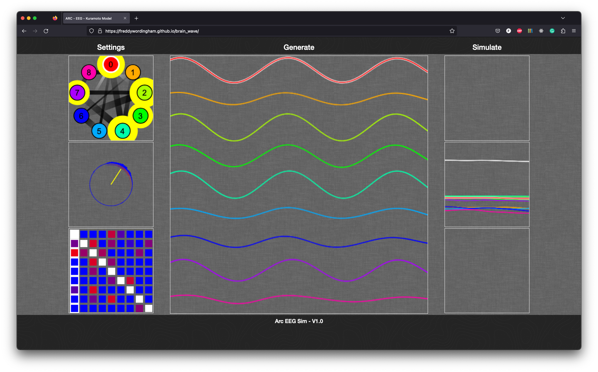
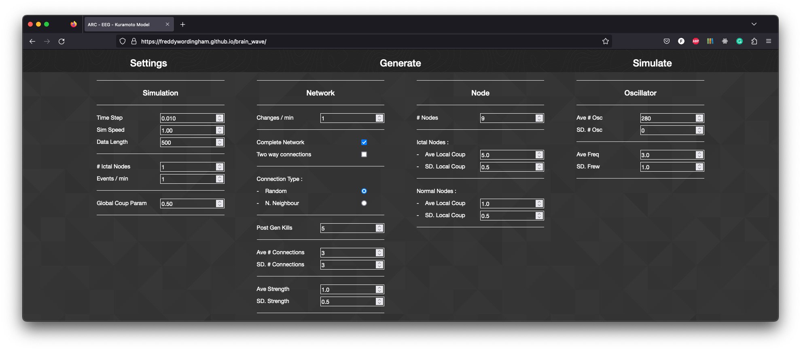

# Kuramoto Model EEG

Electroencephalography (EEG) simulation and visualiser.
Based on the [Kuramoto model](https://en.wikipedia.org/wiki/Kuramoto_model#cite_note-1)

[See me live](https://freddywordingham.github.io/brain_wave/ "Brain Wave")
